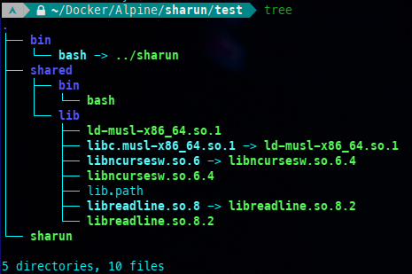

# sharun-C
Run dynamically linked ELF binaries everywhere (musl and glibc are supported).


* It works by mapping the interpreter (such as ld-linux-x86-64.so.2) into memory, creating a stack for it (containing the auxiliary vector, arguments, and environment variables), and then jumping to the entry point with the new stack.
* [lib4bin](https://github.com/Link4Electronics/sharun-C/blob/main/lib4bin) pulls out the binary file and all the libraries on which it depends, strip it and forms the `bin`, `shared/{bin,lib,lib32}` directories (see [screenshots](https://github.com/Link4Electronics/sharun-C?tab=readme-ov-file#screenshots)) and generate a file `shared/{lib,lib32}/lib.path` with a list of all directories that contain libraries for pass it to interpreter `--library-path`. The paths in this file are specified on a new line with a `+` at the beginning and relative to the directory in which it is located.

## Supported architectures:
* aarch64 (ARM 64-bit) — musl-static (CI) or glibc
* arm32v7 (ARM 32-bit) — musl-static (CI) or glibc
* x86_64 (Intel/AMD 64-bit) — musl-static (CI) or glibc
* i386 (Intel/AMD 32-bit) — musl-static (CI) or glibc
* loongarch64 (LoongArch 64-bit) — musl-static (CI) or glibc
* ppc64le (POWER 64-bit little-endian ELFv2) — musl-static (CI) or glibc
* ppc64 (POWER 64-bit big-endian ELFv2) — glibc only (CI via `kth5/archpower` Docker)
* ppc (POWER 32-bit big-endian) — glibc only (local build, `-DSHARUN_STATIC=OFF` — no static libs available)
* s390x (IBM Z 64-bit) — musl-static (CI) or glibc

## To get started:
* **Download the latest revision**
```
git clone https://github.com/Link4Electronics/sharun-C.git && cd sharun
```

* **Compile a binary** (requires C23 compiler, CMake and zlib)
  (add `-DSHARUN_STATIC=ON` for fully static binary)
```
cmake -S . -B build
cmake --build build
cp ./build/sharun .
```

  **Full build** (default): `SHARUN_SETENV=ON SHARUN_LIB4BIN=ON SHARUN_PYINSTALLER=ON` ~130KB.
  
  **Lite build** (no extras): add `-DSHARUN_ELF32=OFF -DSHARUN_SETENV=OFF -DSHARUN_LIB4BIN=OFF -DSHARUN_PYINSTALLER=OFF` ~70KB.

* Or take an already precompiled binary file from the [releases](https://github.com/Link4Electronics/sharun-C/releases)

## Usage sharun:
```
[ Usage ]: sharun [OPTIONS] [EXEC ARGS]...
    Use lib4bin for create 'bin' and 'shared' dirs

[ Arguments ]:
    [EXEC ARGS]...              Command line arguments for execution

[ Options ]:
     l,  lib4bin [ARGS]         Launch the built-in lib4bin
    -g,  --gen-lib-path         Generate a lib.path file
    -v,  --version              Print version
    -h,  --help                 Print help

[ Environments ]:
    SHARUN_WORKING_DIR=/path       Specifies the path to the working directory
    SHARUN_ALLOW_SYS_VKICD=1       Enables breaking system vulkan/icd.d for vulkan loader
    SHARUN_ALLOW_LD_PRELOAD=1      Enables breaking LD_PRELOAD env variable
    SHARUN_ALLOW_QT_PLUGIN_PATH=1  Enables breaking QT_PLUGIN_PATH env variable
    SHARUN_NO_NVIDIA_EGL_PRIME=1   Disables NVIDIA EGL prime logic
    SHARUN_PRINTENV=1              Print environment variables to stderr
    SHARUN_LDNAME=ld.so            Specifies the name of the interpreter
    SHARUN_EXTRA_LIBRARY_PATH      Extra library directories with highest priority
    SHARUN_FALLBACK_LIBRARY_PATH   Fallback library directories with lowest priority
    SHARUN_DIR                     Sharun directory
```

## Usage lib4bin:
```
[ Usage ]: lib4bin [OPTIONS] /path/executable -- [STRACE MODE EXEC ARGS]

[ Options ]:
    -d, --dst-dir '/path'    Destination directory (env: DST_DIR='/path')
    -e, --strace-mode        Use strace for get libs (env: STRACE_MODE=1)
    -t, --strace-time 5      Specify the time in seconds for strace mode (env: STRACE_TIME=5)
    -g, --gen-lib-path       Generate a lib.path file (env: GEN_LIB_PATH=1) (default)
    -h, --help               Show this message
    -i, --patch-interpreter  Patch INTERPRETER to a relative path (env: PATCH_INTERPRETER=1)
    -k, --with-hooks         Pack additional files required for libraries (env: WITH_HOOKS=1)
    -l, --libs-only          Pack only libraries without executables (env: LIBS_ONLY=1)
    -n, --not-one-dir        Separate directories for each executable (env: ONE_DIR=0)
    -p, --hard-links         Pack sharun and create hard links (env: HARD_LINKS=1)
    -q, --quiet-mode         Show only errors (env: QUIET_MODE=1)
    -r, --patch-rpath        Patch RPATH to a relative path (env: PATCH_RPATH=1)
    -s, --strip              Strip binaries and libraries (env: STRIP=1)
    -v, --verbose            Verbose mode (env: VERBOSE=1)
    -w, --with-sharun        Pack sharun from PATH or env or download
                                (env: WITH_SHARUN=1, SHARUN=/path|URL, SHARUN_URL=URL, UPX_SHARUN=1)
    -o, --with-wrappe        Pack with wrappe from PATH or env or download
                                (env: WITH_WRAPPE=1, WRAPPE=/path|URL, WRAPPE_URL=URL)
    -c, --wrappe-clvl 0-22   Specify the compression level for wrappe (env: WRAPPE_CLVL=0-22) (default: 8)
    -x, --wrappe-exec name   Specify the name of the wrappe packaged executable (env: WRAPPE_EXEC=name)
    -m, --wrappe-args 'args' Specify the args for the wrappe packaged executable (env: WRAPPE_ARGS='args')
    -z, --wrappe-dir '/path' Specify path to the sharun dir for packing with wrappe (env: WRAPPE_DIR='/path')
    -u, --wrappe-no-cleanup  Disable cleanup the wrappe unpack directory after exit (env: WRAPPE_CLEANUP=0)
                                It can also be set at runtime (env: STARTPE_CLEANUP=0)
    -y, --with-python        Pack python using uv from PATH or env or download
                                (env: WITH_PYTHON=1, UV=/path|URL, UV_URL=URL)
    -pp, --python-pkg 'pkg'  Specify the python package or '/path/requirements.txt' (env: PYTHON_PKG='pkg')
    -pv, --python-ver 3.12   Specify the python version for packing (env: PYTHON_VER=3.12)
    -pi, --python-pip        Leave pip after install python package (env: PYTHON_LEAVE_PIP=1)
    -pw, --python-wheel      Leave wheel after install python package (env: PYTHON_LEAVE_WHEEL=1)
    -ps, --python-setuptools Leave setuptools after install python package (env: PYTHON_LEAVE_SETUPTOOLS=1)
```

## Examples:
```
# run lib4bin with the paths to the binary files that you want to make portable:
./sharun lib4bin --with-sharun --dst-dir test /bin/bash

# or for correct /proc/self/exe you can use --hard-links flag:
./sharun lib4bin --hard-links --dst-dir test /bin/bash
# this will create hard links from 'test/sharun' in the 'test/bin' directory

# now you can move 'test' dir to other linux system and run binaries from the 'bin' dir:
./test/bin/bash --version

# or specify them as an argument to 'sharun':
./test/sharun bash --version
```
### Packing the `sharun directory` with your applications into a single executable with [wrappe](https://github.com/Systemcluster/wrappe):
```
# packing one executable file /bin/bash to the test/bash executable:
./sharun lib4bin --with-wrappe --dst-dir test /bin/bash

# packing several executable files to the test/sharun multicall executable:
./sharun lib4bin --with-wrappe --dst-dir test /bin/bash /bin/env /bin/ls

# packing several executable files with bash entrypoint to the test/bash executable:
./sharun lib4bin --wrappe-exec bash --dst-dir test /bin/bash /bin/env /bin/ls
```

### Packing the `sharun directory` with your python application into a single executable with [wrappe](https://github.com/Systemcluster/wrappe):
```
# packing python to the test/sharun multicall executable:
./sharun lib4bin --with-python --with-wrappe --strip --dst-dir test

# packing python with python entrypoint to the test/python executable:
./sharun lib4bin --with-python --wrappe-exec python --strip --dst-dir test

# packing python 3.14 and awscli package with aws entrypoint to the test/aws executable in strace mode:
./sharun lib4bin --wrappe-exec aws --strip --with-hooks --python-ver 3.14 --python-pkg awscli --dst-dir test sharun -- aws s3 ls --no-sign-request s3://globalnightlight

# packing python 3.13 and pygame package with examples.aliens entrypoint to the test/python executable in strace mode:
./sharun lib4bin --wrappe-exec python -m '-m pygame.examples.aliens' --strip --with-hooks --python-ver 3.13 --python-pkg pygame --dst-dir test sharun -- python -m pygame.examples.aliens
```

### Packing the [PyInstaller](https://pyinstaller.org) `onedir` app into a single executable with [wrappe](https://github.com/Systemcluster/wrappe):
```
# download python script:
wget https://raw.githubusercontent.com/gdraheim/docker-systemctl-replacement/refs/heads/master/files/docker/systemctl3.py

# Create PyInstaller onedir app:
pyinstaller --name systemctl --onedir systemctl3.py

# download sharun aio:
wget https://github.com/Link4Electronics/sharun-C/releases/latest/download/sharun-$(uname -m)-aio -O ./sharun
chmod +x ./sharun

# packing PyInstaller onedir app with strace mode into a single portable executable:
./sharun lib4bin --with-wrappe --with-hooks --strip ./dist/systemctl/systemctl -- --help

# test it:
./systemctl --help
```

## Additional options:
* You can create a hard link from `sharun` to `AppRun` and write the name of the executable file from the `bin` directory to the `.app` file for compatibility with [AppImage](https://appimage.org) `AppDir`. If the `.app` file does not exist, the `*.desktop` file will be used.

* Additional env var can be specified in the `.env` file (see `dotenv` format). Env var can also be deleted using `unset ENV_VAR` in the end of the `.env` file.

* You can preload libraries using `.preload` file. Specify the necessary libraries in it from a new line. You can use the full paths to libraries or only their names if they are located in `shared/{lib,lib32}/`
This can be useful, for example, to use [pathmap](https://github.com/VHSgunzo/pathmap) library to reassign paths.

## Screenshots:


## Environment variables that are set if sharun finds a directory or file:
|||
|---|---|
|`PATH` | `${SHARUN_DIR}/bin` |
|`PYTHONDONTWRITEBYTECODE` (if $SHARUN_DIR is not writable) | `${SHARUN_DIR}/shared/$LIB/python*` |
|`PERLLIB` | `${SHARUN_DIR}/shared/$LIB/perl*` |
|`GCONV_PATH` | `${SHARUN_DIR}/shared/$LIB/gconv` |
|`GIO_MODULE_DIR` | `${SHARUN_DIR}/shared/$LIB/gio/modules`|
|`GTK_PATH`, `GTK_EXE_PREFIX` and `GTK_DATA_PREFIX` | `${SHARUN_DIR}/shared/$LIB/gtk-*`|
|`QT_PLUGIN_PATH` | `${SHARUN_DIR}/shared/$LIB/qt*/plugins`|
|`BABL_PATH` | `${SHARUN_DIR}/shared/$LIB/babl-*`|
|`GEGL_PATH` | `${SHARUN_DIR}/shared/$LIB/gegl-*`|
|`TCL_LIBRARY` | `${SHARUN_DIR}/shared/$LIB/tcl*`|
|`TK_LIBRARY` | `${SHARUN_DIR}/shared/$LIB/tk*`|
|`GST_PLUGIN_PATH`, `GST_PLUGIN_SYSTEM_PATH`, `GST_PLUGIN_SYSTEM_PATH_1_0`, and `GST_PLUGIN_SCANNER` | `${SHARUN_DIR}/shared/$LIB/gstreamer-*`|
|`GDK_PIXBUF_MODULEDIR` and `GDK_PIXBUF_MODULE_FILE` | `${SHARUN_DIR}/shared/$LIB/gdk-pixbuf-*`|
|`LIBDECOR_PLUGIN_DIR` | `${SHARUN_DIR}/shared/$LIB/libdecor/plugins-1`|
|`GTK_IM_MODULE_FILE` | `${SHARUN_DIR}/shared/$LIB/gtk-*/*/immodules.cache`|
|`LIBGL_DRIVERS_PATH` | `${SHARUN_DIR}/shared/$LIB/dri`|
|`LIBVA_DRIVERS_PATH` | `${SHARUN_DIR}/shared/$LIB/dri`|
|`SPA_PLUGIN_DIR` | `${SHARUN_DIR}/shared/$LIB/spa-*`|
|`PIPEWIRE_MODULE_DIR` | `${SHARUN_DIR}/shared/$LIB/pipewire-*`|
|`GI_TYPELIB_PATH` | `${SHARUN_DIR}/shared/$LIB/girepository-*`|
|`GBM_BACKENDS_PATH` | `${SHARUN_DIR}/shared/$LIB/gbm`|
|`XTABLES_LIBDIR` | `${SHARUN_DIR}/shared/$LIB/xtables`|
|`FOLKS_BACKEND_PATH` | `${SHARUN_DIR}/shared/$LIB/folks/*/backends`|
|`LIBHEIF_PLUGIN_PATH` | `${SHARUN_DIR}/shared/$LIB/libheif/plugins` or `${SHARUN_DIR}/shared/$LIB/libheif`|
|`IMLIB2_LOADER_PATH`|`${SHARUN_DIR}/shared/$LIB/imlib2/loaders`|
|`IMLIB2_FILTER_PATH`|`${SHARUN_DIR}/shared/$LIB/imlib2/filters`|
|||
|---|---|
|`XDG_DATA_DIRS` | `${SHARUN_DIR}/share`|
|`VK_DRIVER_FILES` | `${SHARUN_DIR}/share/vulkan/icd.d`|
|`__EGL_VENDOR_LIBRARY_DIRS` | `${SHARUN_DIR}/share/glvnd/egl_vendor.d`|
|`ALSA_CONFIG_PATH` (if no /usr/share/alsa/alsa.conf) | `${SHARUN_DIR}/share/alsa/alsa.conf`|
|`DRIRC_CONFIGDIR` (if no /usr/share/drirc.d) | `${SHARUN_DIR}/share/drirc.d`|
|`XKB_CONFIG_ROOT` (if no /usr/share/X11/xkb) | `${SHARUN_DIR}/share/X11/xkb`|
|`XLOCALEDIR` (if no /usr/share/X11/locale) | `${SHARUN_DIR}/share/X11/locale`|
|`GSETTINGS_SCHEMA_DIR` | `${SHARUN_DIR}/share/glib-2.0/schemas`|
|`TERMINFO` | `${SHARUN_DIR}/share/terminfo`|
|`TEXTDOMAINDIR` | `${SHARUN_DIR}/share/locale`|
|`MAGIC` | `${SHARUN_DIR}/share/file/misc/magic.mgc`|
|`LIBTHAI_DICTDIR` | `${SHARUN_DIR}/share/libthai/thbrk.tri`|
|`AMDGPU_ASIC_ID_TABLE_PATHS`|`${SHARUN_DIR}/share/libdrm`|
|||
|---|---|
|`FONTCONFIG_FILE` (if no /etc/fonts/fonts.conf) | `${SHARUN_DIR}/etc/fonts/fonts.conf`|
|`SSL_CERT_FILE`, `CURL_CA_BUNDLE`, and `REQUESTS_CA_BUNDLE` (if no /etc/ssl/certs/ca-certificates.crt) | `/etc/pki/tls/cert.pem` or `/etc/pki/tls/cacert.pem` or `/etc/ssl/cert.pem` or `/var/lib/ca-certificates/ca-bundle.pem` (if any is found) |
|---|---|
|`GIO_LAUNCH_DESKTOP` | `${SHARUN_DIR}/bin/gio-launch-desktop`|
|`__EGL_VENDOR_LIBRARY_FILENAMES` | `/usr/share/glvnd/egl_vendor.d/10_nvidia.json` (if env not set)|

## Projects that use sharun:
* [AnyLinux-AppImages](https://github.com/pkgforge-dev/Anylinux-AppImages)
* [AppBundleHUB](https://github.com/xplshn/AppBundleHUB)
* [Converseen](https://github.com/Faster3ck/Converseen)
* [CPU-X](https://github.com/TheTumultuousUnicornOfDarkness/CPU-X)
* [Eden](https://git.eden-emu.dev/eden-emu/eden)
* [Ghostty-AppImage](https://github.com/psadi/ghostty-appimage)
* [GOverlay](https://github.com/benjamimgois/goverlay)
* [GPU-T](https://github.com/lseurttyuu/GPU-T)
* [Interstellar](https://github.com/jwr1/interstellar)
* [LibreSprite](https://github.com/LibreSprite/LibreSprite)
* [MangoJuice](https://github.com/radiolamp/mangojuice)
* [pelfCreator](https://pelf.xplshn.com.ar/docs/tooling/#pelfCreator:~:text=only%20the%20AppDir.-,%2D%2Dsharun,-%3Cbinaries%3E%3A%20Processes)
* [PPSSPP](https://github.com/hrydgard/ppsspp)
* [PrusaSlicer.AppImage](https://github.com/probonopd/PrusaSlicer.AppImage)
* [QDiskInfo](https://github.com/edisionnano/QDiskInfo)
* [RMG](https://github.com/Rosalie241/RMG)
* [RSS Guard](https://github.com/martinrotter/rssguard)
* [SoarPkgs](https://github.com/pkgforge/soarpkgs)

## References
* https://brioche.dev/blog/portable-dynamically-linked-packages-on-linux
